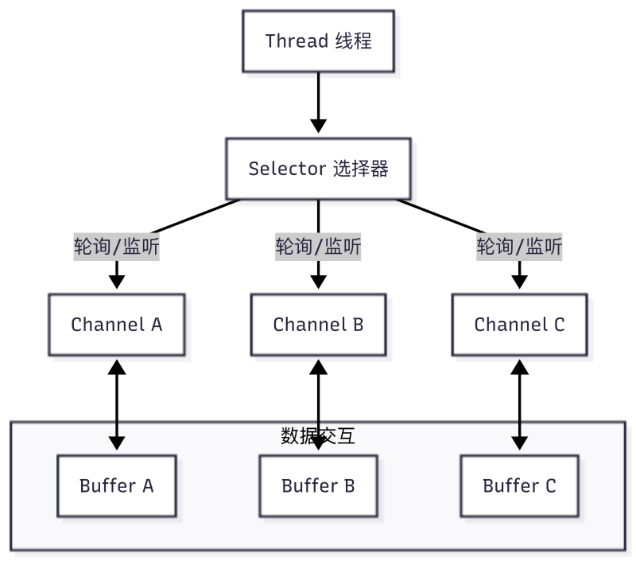

在琢磨代码性能这件事儿时，I/O 往往是那个"定生死"的环节。只有在对的场景，用对的方法去驾驭 I/O，才能真正把程序的效率拉满。这篇文章是我这段时间对主流三种 I/O 方式深入钻研后的心得复盘，算是把这段时间的死磕和折腾记录下来，免得以后脑子短路了还得重新翻源码。

# BIO

当用户线程调用 `read()` 方法时，如果没有数据可读，线程会一直阻塞，直到内核准备好数据并将其复制到用户空间缓冲区，`read()` 方法才返回，线程才能继续执行后续逻辑。

以下是传统BIO的方式处理访问的代码：

```java
public class BioServerDemo {
    public static void main(String[] args) throws IOException {
        ExecutorService executor = Executors.newFixedThreadPool(100);
        ServerSocket serverSocket = new ServerSocket(8088);

        while (!Thread.currentThread().isInterrupted()) {
            Socket socket = serverSocket.accept(); // 阻塞等待连接
            executor.submit(new ConnectionHandler(socket));
        }
    }
}

class ConnectionHandler implements Runnable {
    private final Socket socket;

    public ConnectionHandler(Socket socket) {
        this.socket = socket;
    }

    @Override
    public void run() {
        try (InputStream in = socket.getInputStream();
             OutputStream out = socket.getOutputStream()) {
            byte[] buffer = new byte[1024];
            int bytesRead;
            // 阻塞读取数据
            while ((bytesRead = in.read(buffer)) != -1) {
                // 处理数据并写回
                out.write(buffer, 0, bytesRead);
                out.flush();
            }
        } catch (IOException e) {
            e.printStackTrace();
        } finally {
            try {
                socket.close();
            } catch (IOException ignored) {}
        }
    }
}
```

该模型的关键短板在于严重依赖内核线程（thread）。线程虽然比完整进程轻量，但仍是内核可调度的实体，因此带来若干问题：

1.  创建/销毁线程涉及内核态开销，频繁创建会影响性能（常用的解决是使用线程池复用线程）。

2.  每个线程占用线程栈等资源（在 JVM 中默认栈大小通常在几百 KB 至 1MB 量级），大量线程会消耗大量虚拟地址空间与物理内存，需通过调小栈或改用轻量并发模型缓解。

3.  线程上下文切换需要内核参与，频繁切换会增加系统调用/内核时间，并在高并发短任务场景中显著影响整体吞吐。

4.  在阻塞/同步的设计下，大量线程同时被唤醒或返回可能造成瞬时的运行队列激增（thundering herd），导致 load 和内核态 CPU 使用急升，使系统响应变差。

因此在高并发场景下，常推荐使用线程池、非阻塞 I/O（epoll/kqueue/io_uring）、事件驱动或用户态协程/轻量绿线程来减少内核线程数并提高资源利用率。

# NIO

## 零拷贝

NIO 支持零拷贝接口，为了理解其优势，首先需要说明零拷贝解决了哪些性能瓶颈，以及它在数据传输中具体是如何工作的。

**传统 BIO（上传数据）常见步骤：**

1.  应用调用 `read()`，请求从文件读取数据。

2.  线程进入内核态，内核将磁盘数据读入 **页缓存（page cache）**（内核空间），并将数据从内核空间复制到用户空间的缓冲区；系统调用返回，线程返回用户态。

3.  应用从用户缓冲区读取数据并准备发送，随后调用 `write()`（或 `send`/`sendto`）将数据提交给内核的 socket。

4.  线程再次进入内核态，内核将数据从用户缓冲区复制到 socket 的内核缓冲区，网络栈把数据发往网卡，系统调用返回，线程回到用户态。

在上述流程中，**两次内核↔用户空间的拷贝** 和 **多次用户态/内核态切换** 会消耗大量 CPU 和内存带宽，特别是在大文件和高并发传输时。

**零拷贝 优化（上传数据）常见步骤：**

1.  应用发起"文件直接发送到网络"的请求（例如在 Linux 上使用 `sendfile()`，在 Java 中使用 `FileChannel.transferTo`）。

2.  线程进入内核态，内核在内核空间（页缓存）中直接将文件页的数据交给网络栈------即把页缓存的数据引用或内容放入 socket 的内核缓冲结构，**避免把数据先复制到用户空间**；操作完成后线程返回用户态（通常只需一次系统调用）。

3.  内核由网络栈/NIC 发起 DMA 传输，将数据从内核缓冲区/页缓存发送到网卡并出网。

这样做的好处是：省掉了一次用户空间的内存拷贝（内核→用户→内核 的那次往返）并通常减少系统调用或上下文切换，从而降低 CPU 占用并提高大数据量传输的效率------这就是所谓的 **零拷贝** 概念。

**可以把零拷贝理解为：内核在内核空间直接引用文件的页缓存并把这些页面对应的物理地址或描述符交给网卡，网卡通过 DMA 从内存读取并发送数据，从而避免了将数据先复制到用户空间再复制回内核的中间拷贝。**

可以结合以下的代码去理解零拷贝：

``` java
public static void transferFileContents(SocketChannel socket, Path file) throws IOException {
    try (FileChannel fc = FileChannel.open(file, StandardOpenOption.READ)) {
        long size = fc.size();
        long pos = 0L;
        while (pos < size) {
            // FileChannel.transferTo 的返回值表示实际传输了多少字节。
            // 理想情况下，如果能成功走零拷贝，它会返回一个正数 n > 0，表示已经发送了 n 字节。
            long n = fc.transferTo(pos, size - pos, socket);
            if (n > 0) {
                pos += n;
            } else {
                // transferTo 返回 0，可能是由于socket缓冲区满了，可以等待再重试
                try { Thread.sleep(1); } catch (InterruptedException ignored) {}
            }
        }
    }
}
```

## 非阻塞理念

NIO 在 Java 官方规范中全称为 **New I/O**，因其提供了非阻塞特性，常被俗称为 **Non-blocking I/O**。

其非阻塞特性体现在网络通道（`SocketChannel`）上：当通道配置为非阻塞模式时，调用 `read()` 或 `write()` 不会阻塞线程；若底层缓冲区未就绪，方法会立即返回 0，而不是死等。但如果由用户线程不断调用 `read()` 检查数据，会导致 CPU 空转（忙轮询）。因此，NIO 必须结合 **Selector（多路复用器）** 一同使用——利用操作系统底层的 I/O 多路复用机制（如 Linux 的 `epoll`），让单线程在无事件时休眠，有事件就绪时被内核精准唤醒，以事件驱动替代忙轮询。

在**网络通信**场景下，传统的 BIO 采用“一连接一线程”模型，连接数增多会导致线程栈内存爆炸与频繁的内核上下文切换；NIO 通过 Selector 多路复用，仅需少量线程即可同时监听海量连接，极大降低了系统资源消耗。

在**本地磁盘读写**场景下，操作系统的常规文件 I/O 并不支持非阻塞模式（Java 的 `FileChannel` 也无法注册到 `Selector`）。NIO 在磁盘层面的性能优势并非来自非阻塞，而是来自其提供的底层高性能接口：包括**堆外直接内存（`DirectByteBuffer`）**、**内存映射文件（`MappedByteBuffer`）** 以及支持零拷贝的 **`FileChannel.transferTo`**。



```
[ 网卡收到报文 ]
       │
       │(硬件中断触发)
       ▼ 
[ Linux 内核网络协议栈处理 ] ──> 调用 ep_poll_callback() ──> [ 数据挂入 socket 接收队列 ]
                                                                 │
                                                                 ▼
                                                  [ 将该 epitem 放入 rdlist (就绪链表) ]
                                                                 │
                                                                 ▼
                                                    [ 唤醒正在 epoll_wait 上休眠的线程 ]
                                                                 │
                                                                 ▼
                                           [ Java 线程退出 selector.select() 阻塞状态 ]
                                           
其中：
1. epitem 是内核为每一个被加入 epoll 监控的文件描述符（如 Socket FD）创建的包装结构体。
2. 当调用 epoll_wait 时，内核完全不需要去遍历红黑树上的几万个 FD，只需要检查 rdlist 是否为空，如果不为空，直接遍历 rdlist，把里面的事件信息打包复制到用户态内存空间，清空或按模式重整链表后返回
```

以下是通过Java代码来展示一种通过NIO进行网络读写的方式：

```java
public class NioServerDemo {
    public static void main(String[] args) throws IOException {
        int port = 9000;

        // 1. 创建非阻塞 ServerSocketChannel
        ServerSocketChannel serverChannel = ServerSocketChannel.open();
        serverChannel.bind(new InetSocketAddress(port));
        serverChannel.configureBlocking(false);

        // 2. 创建 Selector 并注册 ACCEPT 事件
        Selector selector = Selector.open();
        serverChannel.register(selector, SelectionKey.OP_ACCEPT);

        System.out.println("NIO Server listening on port " + port);

        ByteBuffer buffer = ByteBuffer.allocate(1024);

        while (true) {
            selector.select(); // 阻塞直到有事件
            Set<SelectionKey> keys = selector.selectedKeys();
            Iterator<SelectionKey> iter = keys.iterator();

            while (iter.hasNext()) {
                SelectionKey key = iter.next();
                iter.remove();

                if (key.isAcceptable()) {
                    // 接受新连接
                    SocketChannel client = serverChannel.accept();
                    client.configureBlocking(false);
                    client.register(selector, SelectionKey.OP_READ);
                    System.out.println("Accepted connection from " + client.getRemoteAddress());
                }

                else if (key.isReadable()) {
                    // 客户端可读
                    SocketChannel client = (SocketChannel) key.channel();
                    buffer.clear();
                    int bytesRead = client.read(buffer);

                    if (bytesRead == -1) {
                        key.cancel();
                        client.close();
                        System.out.println("Client disconnected");
                        continue;
                    }

                    buffer.flip();
                    client.write(buffer); // 回写数据
                }
            }
        }
    }
}
```

# AIO

为了进一步解耦 I/O 操作与应用线程，Java 7 引入了 NIO.2，也就是常说的 **AIO（Asynchronous I/O，异步 I/O）**。

NIO 与 AIO 的核心分歧在于 **Reactor（就绪通知）** 与 **Proactor（完成通知）** 两种模型的差异：

- **NIO（就绪驱动）**：操作系统通知应用程序“数据已到达内核缓冲区，可以读了”，随后**应用线程必须亲自发起系统调用，将数据从内核空间拷贝至用户空间缓冲区**。拷贝过程中线程处于同步等待状态。
- **AIO（完成驱动）**：应用程序预先分配用户态缓冲区（`ByteBuffer`）并提交给操作系统，调用即刻返回。操作系统在内核中完成**数据接收、协议栈解析以及从内核态到用户态的内存拷贝**全过程。直到数据已被完整写入用户缓冲区后，系统才通过回调（`CompletionHandler`）通知应用直接处理业务数据。

换言之，AIO 是**将“等待数据就绪”和“内核到用户态的数据搬运”这两道工序全部托管给操作系统**，应用层不再感知任何 I/O 阻塞。

**需要注意的是**，AIO 在不同操作系统上的底层实现差异极大：

- 在 **Windows** 平台上，底层依托成熟的内核级 **IOCP（I/O Completion Ports）**，是真正意义上的系统级异步 I/O。
- 在 **Linux** 平台上，内核原生的 AIO（`libaio`）长期仅支持带 `O_DIRECT` 的本地文件，不支持网络 Socket。因此 Java AIO 在 Linux 底层依然是依赖 `epoll` 配合线程池模拟实现的，不仅没有带来预期中的性能飞跃，反而引入了额外的线程切换与内存开销。这也是主流网络框架（如 Netty）选择放弃 Java AIO、坚持采用基于 Linux 原生 `epoll` 的 NIO 模型的原因。

> `O_DIRECT` 是 Linux 系统中打开文件（`open()` / `openat()` 系统调用）时可传入的一个标志位（Flag），用于开启**直接 I/O（Direct I/O）**。
>
> 它的核心作用是：在进行文件读写时，完全绕过操作系统的内核页缓存（Page Cache），**直接在用户空间缓冲区与存储设备之间进行数据传输**。

可以参考如下Java代码去理解：

``` java
private static void writeFile(AsynchronousSocketChannel client, AsynchronousFileChannel fileChannel,
                              ByteBuffer buffer, long position) {
    fileChannel.read(buffer, position, null, new CompletionHandler<Integer, Void>() {
        @Override
        public void completed(Integer bytesRead, Void attachment) {
            if (bytesRead == -1) {
                // 文件发送完成
                try { client.close(); fileChannel.close(); } catch (IOException ignored) {}
                System.out.println("File sent successfully!");
                return;
            }
            buffer.flip();
            client.write(buffer, null, new CompletionHandler<Integer, Void>() {
                @Override
                public void completed(Integer bytesWritten, Void attachment) {
                    buffer.clear();
                    writeFile(client, fileChannel, buffer, position + bytesRead); // 继续读取并写入
                }

                @Override
                public void failed(Throwable exc, Void attachment) {
                    exc.printStackTrace();
                }
            });
        }

        @Override
        public void failed(Throwable exc, Void attachment) {
            exc.printStackTrace();
        }
    });
}
```

# 总结

| **特性 / 维度**  | **BIO（Blocking I/O）**                                | **NIO（New I/O / 多路复用）**                           | **AIO（NIO.2 / 异步 I/O）**                                  |
| ---------------- | ------------------------------------------------------ | ------------------------------------------------------- | ------------------------------------------------------------ |
| **内核驱动模式** | 阻塞等待数据到达并阻塞拷贝                             | **Reactor 模式（就绪通知）**                            | **Proactor 模式（完成通知）**                                |
| **线程行为**     | 线程发起 I/O 后一直阻塞等待                            | 线程阻塞在 `Selector.select()` 上，有事件就绪时唤醒分发 | 线程发起 I/O 后立即返回，底层完成拷贝后通过回调通知          |
| **数据拷贝阶段** | 用户线程同步阻塞拷贝（内核 $\to$ 用户）                | 用户线程被唤醒后，**亲自发起系统调用同步拷贝**          | **操作系统在后台直接将数据拷贝进用户态缓冲区**               |
| **适合场景**     | 连接数少且架构简单的传统系统；JDK 21+ 虚拟线程网络编程 | **Linux 平台高并发网络服务（Netty/Tomcat 核心基石）**   | **Windows 平台网络服务（IOCP 底层）**、大文件异步读写        |
| **局限 / 缺点**  | 传统线程模型下并发连接数严重受限                       | 编程与状态管理复杂，存在粘包半包、断连等细节处理        | Linux 原生 Socket 异步支持不足（Java AIO 依赖线程池模拟），生态支持弱 |

