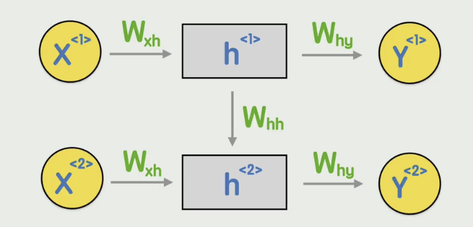
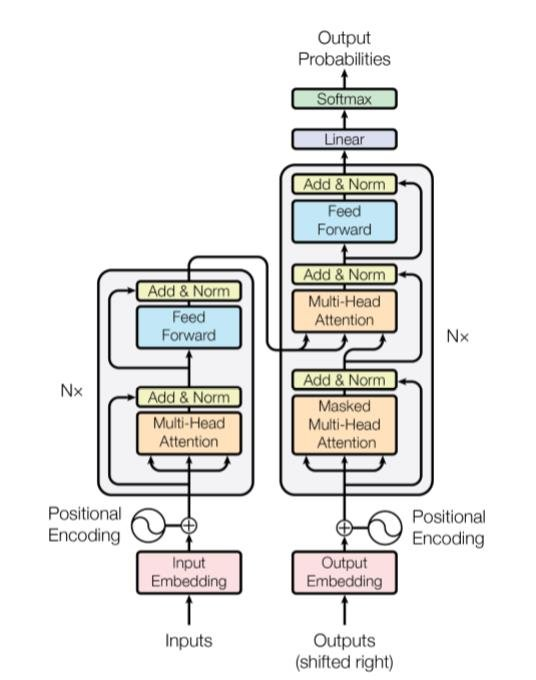

本文旨在总结我在研究生课题组中围绕检索增强生成（RAG）开展的研究工作，并系统梳理从大语言模型（LLM）基础到复杂智能体（Agent）架构的知识体系。

# NPL（Natural Language Processing，自然语言处理）

## RNN



**RNN的运行步骤（如图所示）如下：**

1.  **输入的向量化 (Embedding)**

首先，将一句话中的每一个 **词（Token）**通过 **Embedding层（后面会提到）**转化为向量，记为$X^t$。这些向量序列按照时间步（Time Step）一个接一个地进入模型。

2.  **隐藏状态的演进 (Hidden State)**

每输入一个$X^t$，神经网络会更新其内部的**隐藏状态**$h^t$：

- **承前启后**：$h^t$并不只取决于当前的输入$X^t$，它还融合了上一个时刻的记忆$h^{t-1}$。

- **上下文编码**：$h^t$实际上是一个压缩的向量，它"携带"了从起始词$X^1$到当前词$X^n$的所有历史上下文信息。

3.  **递归循环**

将当前时刻的输出$h^t$与下一个时刻的输入$X^{t+1}$再次投入同一个神经网络单元中。这个过程在空间上展开就像你图片中展示的那样，但在时间上，它是**同一个权重矩阵 (Wxh,Whh,Why)** 在不断被重复使用。

4.  **输出结果**

- 在情感分析（正面/负面）任务中，通常我们只取最后一个隐藏状态$h^t$对应的输出$Y^t$。因为理论上最后一个 h 已经包含了全句的信息。

- 例如命名实体识别（NER），每个词都需要对应一个标签（如：人名、地名），这时每一个步长的 Y 都会被实时输出。

**缺点：**

- **串行计算效率低：**传统的 RNN 结构虽然在每一时刻 t 都能产生输出 $Y^{<t>}$，但它的致命弱点在于其链式依赖关系：$Y^{<t>}$的计算必须等待$h^{<t-1>}$完成，这导致了计算无法并行。而这也是后来 Transformer 舍弃这种结构，改用 Self-Attention 实现并行化的核心动力。

- **长期依赖问题：**由于 RNN 的结构是链式递归的，信息每经过一个时间步，都要被权重矩阵 W 乘一遍。如果一句话非常长（比如 50 个词），等传到第 50 个词时，第 1 个词的信息经过了 50 次矩阵乘法，已经变得极其模糊。

## Transformer

由于RNN架构有很多问题，Google提出了新的架构Transformer架构，他引入了注意力机制：



Transformer 认为：既然文字已经数字化成了向量，为什么不让每个词直接和全句的所有词进行对话呢？

在 Transformer 内部，我们不再通过$h^{<n>}$这种中间商来传递上下文。相反，每一个词向量都会生成三个向量：**Query**、**Key**和 **Value**。

- 当模型处理一个词时，它会用自己的 Query 去匹配全句其他词的 Key。

- 匹配度越高（点积越大），它分给那个词的权重（Attention Score）就越高。

- 最后，它把全句所有的 Value 根据这些权重加权求和，就得到了这个词在当前语境下的精准含义。

打个形象的比方："RNN 像是看直播，你必须一秒一秒地往下看，错过前面可能就接不上后面；而 Transformer 像是看思维导图，虽然有先后顺序，但你可以瞬间跳跃，把两个隔得很远的知识点连在一起。"，至于算法的具体细节，可以自行观看《Attention is all you need》这篇论文。

# Embedding（词嵌入）

在利用神经网络处理文本任务时，首要环节是将离散的文本符号转化为连续的高维向量表征。这一映射过程由 Embedding 模型实现，旨在将抽象的语义信息投影至可计算的特征空间中。下文将详细解析几种主流的词嵌入演进路径及其技术原理。

## One-hot

假设有n个词，那么每个词就是一个n维向量，第一个词是\[1,0,0,0,\...\]，第二个词是\[0,1,0,0,\...\]，以此类推。这样的方式缺点也很明显：

- 每个词向量都是稀疏的，所以 **空间利用率极低**。

- 由于每一个向量都是正交的，所以模型 **无法从向量本身判断词与词之间的关系**。

- One-hot 是一种固定的规则映射，不包含任何可学习的参数，这就导致他不可被训练，无法训练出词与词之间的关系。

## Word2Vec

它的核心任务是将自然语言中的词语转化为计算机可以理解的数值向量。与传统的编码方式不同，Word2Vec 能够捕捉词与词之间的语义相似度和逻辑关系。

Word2Vec 建立在一个重要的语言学假设之上：**上下文相似的词，其语义也相似**。 例如，"猫"和"狗"经常出现在"宠物"、"吃"、"睡觉"等词语周围，因此在向量空间中，它们的距离会非常接近。

这就暴露出了Word2Vec的缺点：

- 在 Word2Vec 中，一个词对应 **唯一** 一个向量。无论"苹果"是指水果还是科技公司，无论"Bank"是指银行还是河岸，Word2Vec 都会把它们压缩成同一个向量。这就导致了向量被多种语义"**污染**"，导致在特定语境下表达不准确。

- Word2Vec 依赖于一个固定大小的 **滑动窗口**，这就导致它只能捕捉窗口内的局部特征，**无法理解长句子或段落中的长距离依赖关系**。例如，句子开头的代词指代的是段落结尾的哪个名词，Word2Vec 很难捕捉到。

## BERT

如果说 Word2Vec 是 NLP 领域的"查字典"，那么 BERT (Bidirectional Encoder Representations from Transformers) 就是拥有"理解力"的阅读者。它的核心任务不再是给每个词发一张固定的身份牌，而是根据语境实时计算词语的数值向量。

BERT 建立在一个更深层的语言学假设之上：**一个词的真正含义，是由它在当前句子中所处的"环境"动态决定的**。

BERT是一个革命性的技术，他的优点有很多：

- 动态编码：基于语境实时生成向量，**彻底解决"一词多义"痛点**。

- 全向感知：突破滑动窗口限制，通过自注意力机制**捕捉全局长程依赖**。

- 范式革命：开启"预训练+微调"模式，由于BERT是通过完形填空的方式训练的，所以**极少量数据**即可迁移至下游任务。

## Embedding Model

这就是应用层面的句子级 Embedding（Sentence Embedding）。它打破了孤立词汇的边界，通过复杂的聚合算法将整段文本映射为一个定长的**高维稠密向量**。

在 RAG（检索增强生成）的架构中，它是绝对的**"语义心脏"**：它不仅将非结构化的长文本翻译成了计算机可运算的数学语言，更赋予了机器跨越字面、直达意图的"读心术"。正是通过这种转换，万亿规模的文档库才得以在毫秒间被精准检索，为大模型源源不断地输送事实依据。

# LLM（Large Language Model）

优秀的系统设计始于对底层 **黑盒** 的拆解。本节将聚焦于 LLM 的核心实现机理，尽管在工程应用中这些细节通常被视为透明的抽象层，但掌握其运行逻辑能够帮助我们更精准地预测模型行为并设计高效的 Prompt 策略。

## Token

大模型并不直接读"字"或"词"，而是将文本切割成一系列更小的单位，这些单位就是 Token。

你可以把模型想象成一个吃货：

- 字符（Character）：就像是面粉，太碎了，没味道。

- 单词（Word）：像是一整块披萨，有时候太大，一口吞不下。

- Token：就像是切好的披萨块。它比字母大，比完整的单词小（或相等），是模型最容易消化的尺寸。

举几个例子方便理解：

- 假设我们有一个单词：\"unhappiness\"。\
  模型通常不会把它看作一个整体，也不会看作 11 个字母，而是切成： un (表示否定的前缀) happi (词根) ness (表示状态的后缀)

- 假设有一句话："我喜欢强化学习" ，不同的分词器（Tokenizer）可能会有不同的切法。\
  常见的切分逻辑是： 我 / 喜欢 / 强化 / 学习\
  或者是：我 / 喜 / 欢 / 强 / 化 / 学 / 习

## Temperature (温度)

大语言模型（LLM）的生成本质是针对词表中每个词元（Token）的概率预测过程。模型输出的原始分值$z_i$（Logits）通过带有温度参数$T$ 的 **Softmax 函数**转化为概率分布：

$$P_i = \frac{\exp(z_i / T)}{\sum_j \exp(z_j / T)}$$

该机制通过调节$T$ 的取值，在生成结果的 **确定性** 与 **随机性** 之间进行权衡。其核心表现可归纳为以下三种临界状态：

**标准状态 (**$T = 1$**)**：

公式退化为标准 Softmax 函数。模型按照训练时学到的原始概率分布进行采样，兼顾了结果的逻辑性与多样性。

**收敛状态 (**$T \to 0$**)**：

概率分布向 Logits 中的最大值剧烈坍缩。此时效果等同于 **Argmax** 运算，即 **贪婪搜索（Greedy Search）**。模型会始终选择概率最高的词元，输出结果高度确定、稳定，但极易陷入重复。

**发散状态 (**$T \to \infty$**)**：

Logits 之间的数值差异被平滑处理，所有词元的被选概率趋于相等。概率分布转变为 **均匀分布（Uniform Distribution）**，模型表现为完全随机选词，输出内容通常失去逻辑，呈现"胡言乱语"状态。

## Top-P & Top-K {#top-p-top-k}

Top-P 并不是固定选前几个词，而是选出一组概率加起来**刚刚达到或者超过 P 值**（如 0.9）的词语，然后只在这个小范围里抽选下一个词。AI 会把所有可能的下一个词按可能性从高到低排好，然后从最可能的词开始加总它们的概率，直到总概率达到 P 值。

Top-K 是一种在文本生成任务中，用来决定AI下一个词语该选谁的策略。AI 会把所有可能的下一个词按可能性从高到低排好，然后直接截取排名**最靠前的 K 个**词语，AI 会在这个固定的池子里随机抽选下一个词。

## Prompt（提示词）

Prompt 的本质是**Token 序列**。神经网络的底层逻辑始终是根据既有序列预测下一个 Token（Next-token prediction）。

现代聊天机器人（如 ChatGPT、Gemini、DeepSeek）之所以能表现出"对话"能力，并非改变了预测逻辑，而是通过 **Chat Template（对话模板）** 将结构化的对话内容序列化为单一字符串。模型在训练阶段（特别是 SFT 指令微调阶段）已经大量学习了这种特定格式，使其能够识别不同角色的界限。

在 Dify 等编排工具中，对话被抽象为三种核心角色：

- **System Prompt（系统提示词）：** 定义模型的角色、行为准则、知识边界及输出限制。它作为全局上下文，优先级最高。

- **User Prompt（用户提示词）：** 承载当前回合的具体指令或问题，这就是我们交流中经常说的Prompt所指代的内容。

- **Assistant Message：** 模型生成的回复内容，在多轮对话中作为历史上下文输入，用于维持对话的连贯性。

例如 **ChatML** 协议，模型接收到的实际输入是一个被特殊分隔符（Special Tokens）包裹的长字符串：

     <|im_start|>system
     你是一个资深的后端工程师，回答需简洁、专业。<|im_end|>
     <|im_start|>user
     如何优化 MySQL 的大表查询？<|im_end|>
     <|im_start|>assistant
     优化大表查询应从索引、SQL 语句、架构设计和数据拆分四个维度入手：...... <|im_end|>

## Context（上下文）

LLM 本身是 **无状态（Stateless）**的。它不会像人类大脑那样实时存储记忆。模型之所以显得有记忆，是因为程序（如 Dify、ChatGPT 网页端）自动帮你把之前的对话内容重新拼接到 Context 字符串中发送了过去。

**具体场景事例：**

假设你正在和一个 AI 助手讨论 Python 编程：

**第一轮（初始状态）**

- **User:** 你好，你会写 Python 吗？

- **拼接后的输入字符串：**

``` plaintext
 <|im_start|>system
 你是一个专业的编程助手。<|im_end|>
 <|im_start|>user
 你好，你会写 Python 吗？<|im_end|>
 <|im_start|>assistant
```

- **模型生成的回答：** "你好！我会写 Python，请问有什么可以帮你的？"

**第二轮（产生上下文）**

- **User:** 那请帮我写一个快速排序算法。

- **拼接后的输入字符串：**

  此时，系统会自动抓取第一轮的对话，拼接到当前问题之前：

``` plaintext
 <|im_start|>system
 你是一个专业的编程助手。<|im_end|>
 <|im_start|>user
 你好，你会写 Python 吗？<|im_end|>
 <|im_start|>assistant
 你好！我会写 Python，请问有什么可以帮你的？<|im_end|>
 <|im_start|>user
 那请帮我写一个快速排序算法。<|im_end|>
 <|im_start|>assistant
```

**以LangChain代码为例：**

``` python
chat_prompt = ChatPromptTemplate.from_messages([
    SystemMessage(content="你是一个乐于助人的 AI。"),
    HumanMessage(content="你好，我叫小明。"),
    AIMessage(content="你好，小明！很高兴见到你，有什么我可以帮你的吗？"),
    HumanMessage(content="你还记得我的名字么？")
])
```

## Emergent Abilities（涌现能力）

涌现能力是指那些在小型模型中不存在，但在模型规模（参数量、训练计算量或数据量）达到一定临界值（Threshold）后突然出现的复杂能力。当模型规模达到一定程度时，以下能力通常会显著增强或首次出现：

- **少样本提示（Few-shot Prompting）**：模型仅通过几个示例就能学会执行未见过的任务。

- **思维链推理（Chain of Thought, CoT）**：通过引导模型输出中间推理步骤，显著提升解决复杂数学或逻辑问题的能力。

- **指令遵循（Instruction Following）**：能够准确理解并执行人类通过自然语言下达的复杂指令。

- **跨任务泛化**：处理多语言翻译、常识推理、逻辑谜题等模型未在预训练中专门学习的任务。

## LLM局限性

- 知识时效性与孤岛效应 (Knowledge Cutoff & Silos)

  - **预训练数据滞后**：LLM 的知识停留在预训练结束的那一刻（Training Data Cutoff）。对于之后发生的实时新闻、技术更新无法感知。

  <!-- -->

  - **私域知识真空**：模型无法访问企业内部文档、个人笔记或非公开的数据库。

<!-- -->

- 幻觉问题 (Hallucinations)

  - **概率预测本质**：LLM 基于 Token 概率分布生成文本，而非基于事实库检索。在面对生僻知识或复杂事实推理时，会生成看似合理但完全错误的内容。

  <!-- -->

  - **缺乏事实一致性检查**：模型无法自我验证输出内容的真实性。

<!-- -->

- 缺乏与现实世界的交互 (Passive Nature)

  - **静态推理**：原生模型只能在给定的上下文（Context）内进行文字博弈，无法直接调用外部工具（如搜索引擎、计算器、API）来获取实时数据或执行物理动作。

  <!-- -->

  - **复杂任务不可控**：在处理需要多步规划和环境反馈的任务时，单次 Prompt 往往难以维持长路径的逻辑准确性。
