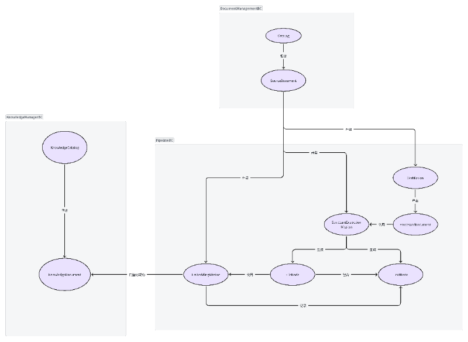

# 背景

## 项目背景与业务背景

当前项目为实验室知识体系平台的核心 RAG模块。核心业务流涉及非结构化文档的入库与检索，主要包含文档的 OCR 识别、基于文本结构的段落切分（Chunking）以及向量化（Embedding）特征提取。

为了解决海量文档混合存储导致的召回率低下问题，系统设计了多知识库隔离机制。实际业务中，同一份物理文档允许被映射并添加至多个不同的知识库中。

本次接手该模块属于"第三代"维护。核心业务诉求是将原有的"按固定字符数切分文档"重构为"基于文档物理结构的智能解析与切分"。但在梳理前两代遗留的 Python 代码时，发现了严重的底层架构问题。

## 痛点分析

原有系统采用面向过程的脚本化编写方式，代码严重腐化，暴露出以下阻碍系统演进的痛点：

- **异步任务状态机混乱：** 文档处理涉及的 OCR、切分、向量化均为耗时的异步任务。原系统缺乏统一的生命周期管理与容错机制。一旦某个后台子任务失败，状态流转即刻中断，导致前端界面出现假死（持续显示"正在运行中"）。

- **领域概念混淆引发性能瓶颈：** 旧系统未能剥离"物理文件实体"与"文件-知识库关联关系"。在处理"将已有文件添加至新知识库"这一操作时，未能复用已有的向量化数据，而是盲目触发全新的向量化任务。这不仅导致计算资源无效消耗，更引发了长耗时阻塞及入库失败率激增。

- **高流动性与沟通断层：** 实验室开发团队具有"每年一换"的高流动性特征，且需求提出方（导师）与执行方（学生）之间存在沟通信息差，导致需求在落地时发生逻辑扭曲（如上述重复向量化问题）。

## 架构演进与技术选型

针对上述痛点，决定废弃原有的 Python 脚本化代码，将底层服务迁移至 JVM 生态，引入领域驱动设计（DDD），并采用 Kotlin 与 Java 协同开发的模式。

**引入 DDD 的核心动机：**

引入 DDD 的目的在于应对团队特有的开发环境。通过建立"统一语言（Ubiquitous Language）"消除师生间及团队内部的沟通歧义；利用"限界上下文（Bounded Context）"将RAG模块和其他模块彻底解耦。最终目标是沉淀出能够抵御高频人员变动的业务资产，使代码结构本身成为最准确的系统文档。

**Kotlin 与 Java 混编选型策略：**

领域层（Domain Layer）采用 Kotlin 以强化约束：领域层包含长任务状态流转、知识库关联等核心业务规则。利用 Kotlin 严格的编译器级别约束（如空安全机制、明确区分只读集合与可变集合、数据类及密封类），可以更严谨地实现 DDD 中值对象的不可变性以及状态机的穷举校验。这部分核心模型由架构设计者统一使用 Kotlin 构建。

其他分层采用 Java 以降低协作门槛：应用层的服务编排、基础设施层的 Spring Boot 接口暴露及数据库依赖注入等，由其他协作成员使用最擅长的 Java 编写。此举充分考虑了团队成员的技能储备，利用两种语言 100% 的互操作性，在保护核心业务逻辑不被破坏的前提下，最大化团队并行开发效率并降低后续的交接风险。

# 战略设计

针对原有系统职责不清、向量数据管理混乱的问题，本次重构在战略层面将系统划分为三个限界上下文（Bounded Context）：`DocumentManagementBC`、`PipelineBC` 和 `KnowledgeManagerBC`。



## 核心上下文拆解

**PipelineBC（流水线上下文）**

- **职责**：作为系统的核心引擎，统一管理文档预处理的完整生命周期与中间产物。

- **核心模型**：

  - **任务实体（Missions）**：将异步任务抽象为独立的实体，包括 `OcrMission`（OCR任务）、`StructureExtractionMission`（结构抽取任务）和 `EmbeddingMission`（向量化任务）。明确了各任务的状态机运转逻辑。

  - **中间产物（Nodes）**：`ProcessedDocument`（OCR处理结果）、`FileNode` 和 `TextNode`（基于结构切分的节点）。任务执行完毕后生成对应节点，确保数据溯源清晰。

**KnowledgeManagerBC（知识管理上下文）**

- **职责**：专门处理知识库映射与向量数据生命周期，解决原系统中因物理文件与知识库强耦合导致的"重复向量化"问题。

- **核心模型**：

  - **KnowledgeCatalog**：抽象出的知识库实体。

  - **KnowledgeDocument**：**核心解耦点。** 它代表已经完成向量化的文件资产，而非原始的物理文件。

**DocumentManagementBC（文档管理上下文）**

- **职责**：管理原始上传文件，同时作为兼容遗留系统的防腐层。

- **核心模型**：`Catalog`（目录）与 `SourceDocument`（源文件）。它收口了其他老模块的交互逻辑，将外部输入转化为标准化的 `SourceDocument`，为下游流水线提供干净的起点。

## 实际收益

在完成限界上下文划分并输出领域图后，项目在团队协作与代码维护上获得了以下具体收益：

### 领域图驱动的高效协同

1.  **降低团队理解成本：** 领域图提供了清晰的系统全局视角。组内开发人员可通过领域图快速掌握整体业务逻辑，明确自身负责子模块的边界与职责，从而更独立、准确地完成开发任务。

2.  **消除跨角色沟通信息差：** 在与导师的需求对齐与进度汇报中，领域图作为"统一语言"的视觉载体，替代了模糊的口头描述，使业务逻辑的沟通变得直观且高效。

3.  **前置设计指导研发：** 前期构建领域模型的过程，强制开发者遍历并推演了所有业务场景。这种自顶向下的梳理为后续的编码落地提供了宏观约束与指导，减少了返工率。

### 核心领域抽象消除历史技术债

- **精确定位并化解高危 Bug 区**：原系统中，因缺乏合理的领域模型，向量数据管理模块逻辑交织，成为 Bug 频发且前任开发者无力维护的重灾区。

- **概念剥离**：这是解决师生沟通断层与系统逻辑谬误的关键解法。通过引入 `KnowledgeDocument`，系统将"物理文件"与"已向量化知识资产"严格区分。这一抽象准确反映了多知识库复用同一向量数据的业务诉求，从根本上理顺了原本混乱的映射关系，清除了该核心模块的维护障碍。

# 反思

## 过度设计

本次重构最终代码量约 3 万行。作为首次落地 DDD 的实践，项目在具体代码实现阶段曾陷入"过度解耦"的误区，主要体现在上下文通信机制的复杂化。

- **上下文通信机制的纠结**

  在处理 `PipelineManager` 与 `KnowledgeManager` 的跨界交互时，前期试图严格遵循 DDD 理论，引入 **领域事件（Domain Events）** 与 **专属网关接口（Gateway）**。这导致在设计阶段反复横跳：例如纠结"任务开启"或"任务结束"是否必须定义为独立的领域事件发布，以及 `PipelineManager` 是否需要额外定义防腐层接口来间接访问 `KnowledgeManager`。

- **脱离实际约束的架构预判**

  强行解耦的初衷是为了应对未来可能的变化，但忽略了客观约束条件：

  1.  **演进不确定性**：`KnowledgeManager` 未来是否会膨胀为独立微服务，`DocumentManager` 是否会全面重构，目前均无定论。基于未知假设进行提前设计，徒增了系统复杂度。

  2.  **边界与权限限制**：当前任务聚焦于单一子模块的重构与落地，而非主导整个实验室系统的微服务化拆分。

  3.  **时间成本**：在有限的开发周期内，维护一套复杂的事件分发与网关机制会严重拖慢交付效率。

经评估，对于当前的系统体量与团队协作模式，放弃复杂的领域事件机制，直接在应用层（Application Layer）调用目标上下文的接口是兼顾效率与可维护性的最优解。架构设计必须根据实际的业务阶段、团队权限及时间限制来决定解耦粒度，坚持技术服务于业务，避免为了套用 DDD 概念而造成过度设计。

## 异常处理

项目初期未制定全局的异常处理规范，导致异常的抛出边界、捕获时机以及拦截策略模糊。随着业务复杂度的增加，为了修补这些逻辑漏洞，业务代码中充斥着大面积的 try-catch 块。这不仅极大地增加了代码的维护成本，也让业务编排逻辑被底层的技术细节严重污染。

项目中的一个核心误区是 **"滥用运行时异常来处理业务失败"**。例如，遇到非预期的文件格式时，抛出了 IllegalAccessException。预期的业务失败（如校验不通过、外部状态不符合预期）属于正常的控制流，应通过返回标准化的结果对象（如 Result）来进行流转。**运行时异常仅应用于兜底 "无法预料且无法恢复的系统级灾难"（如数据库宕机、内存溢出）**。

以下面的 OCR 处理流程中的 minerU 方法为例，该方法涉及网络和 I/O 操作，出现超时或读取失败是完全可以预料的。这类技术异常（如 IOException）绝对不应该直接穿透到领域层或应用服务层，但是下面的代码中`ocrGateway.minerU(content)` 却抛出的是运行时异常。 合理的做法是：**在基础设施层（Infrastructure）将其消化**。例如下面的异常是业务上会发生的，所以基础设施层应将其捕获，并转化为 Result.failure(\"网络解析异常\") 返回给上层。

``` java
try {
    SourceDocument sourceDocument = sourceDocumentOptional.get();
    BufferedInputStream content = FileUtils.INSTANCE.checkPdf(
        sourceDocumentRepository.openContent(sourceDocument.getFilePath())
    );
    if (content == null)
        throw new IllegalAccessException("不是一个OCR文件");
    MinerUMarkdownFile minerUMarkdownFile = ocrGateway.minerU(content);
    // 保存文件，markdown文件名称随机生成
    ProcessedDocument markdownDocument = ProcessedDocument.Companion.create(
        sourceDocument.getId(),
        generateFilePath(UUID.randomUUID() + ".md"),
        ProcessedDocumentType.MARKDOWN
    );
    minerUMarkdownFile.getImages()
        .forEach(minerUImage -> {
            ProcessedDocument imageDocument = ProcessedDocument.Companion.create(
                sourceDocument.getId(),
                generateFilePath(minerUImage.getRelativePath()),
                ProcessedDocumentType.IMAGE
            );
            processedDocumentRepository.save(imageDocument, new ByteArrayInputStream(minerUImage.getData()));
        });
    processedDocumentRepository.save(
        markdownDocument,
        new ByteArrayInputStream(minerUMarkdownFile.getMarkdownContent().getBytes(StandardCharsets.UTF_8))
    );

    ocrMission.success(markdownDocument.getId());
} catch (Exception ex) {
    String msg = ex.getMessage() != null ? ex.getMessage() : "未知的异常";
    ocrMission.failure(msg);
}

对于调用方需要显式处理的预期业务失败，应使用明确的结果类型进行表达；对于基础设施产生的技术异常，应在基础设施边界进行异常翻译，避免具体技术异常侵入应用层；而对于违反领域不变量或无法由当前流程恢复的非预期错误，则可以继续通过异常机制传播。Application Layer 应该编排业务结果，而不是识别 IOException、HTTP 超时等基础设施实现细节。
```

## 业务与技术的边界

在DDD架构中，所有的技术细节都应封装在基础设施层（Infrastructure）。Gateway 或 Repository 的接口必须纯净，绝对不应暴露任何底层技术实现细节。
最初我将结构提取和结果持久化暴露为两个独立的 Gateway 方法，但在实际流程中，Pipeline 并不存在“只提取而不保存”的业务场景。应用层拿到 TextNodeDTO 后也不会执行任何业务判断，而只是立即将其重新传递给 save()。因此，这种接口设计实际上让应用层承担了基础设施内部流程的编排职责。

``` kotlin
interface StructureExtractionGateway {
    // 提取文档树结构
    fun extract(inputStream: InputStream): TextNodeDTO
    // 保存文档树结构
    fun save(textNodeDTO: TextNodeDTO)
}
```

最终我将结构解析与结果持久化收敛为一个完整的结构提取能力。对于 Pipeline 来说，结构提取完成意味着结构化结果已经生成并进入可使用状态，而不是单纯完成一次 结构提取 调用。


``` kotlin
interface StructureExtractionGateway {
    // 提取文档结构，并保存入数据库，返回这棵树的唯一标识
    fun extract(inputStream: InputStream, sourceDocumentId: String): String
}
```

结构化结果虽然是 Pipeline 的中间产物，但同时也是系统中的持久化数据。Pipeline 完成后，前端仍然可以通过独立的查询接口读取并展示这一结果。这样就将技术完全的写在了infrastructure中。应用层应该编排具有业务意义的能力，而不是编排一个能力内部必然连续发生的技术步骤。
