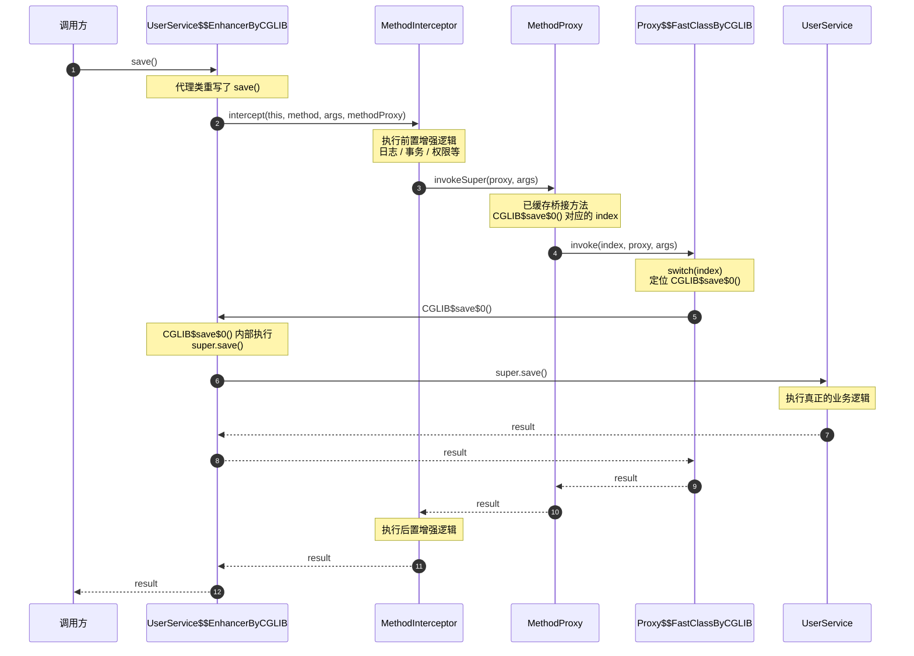
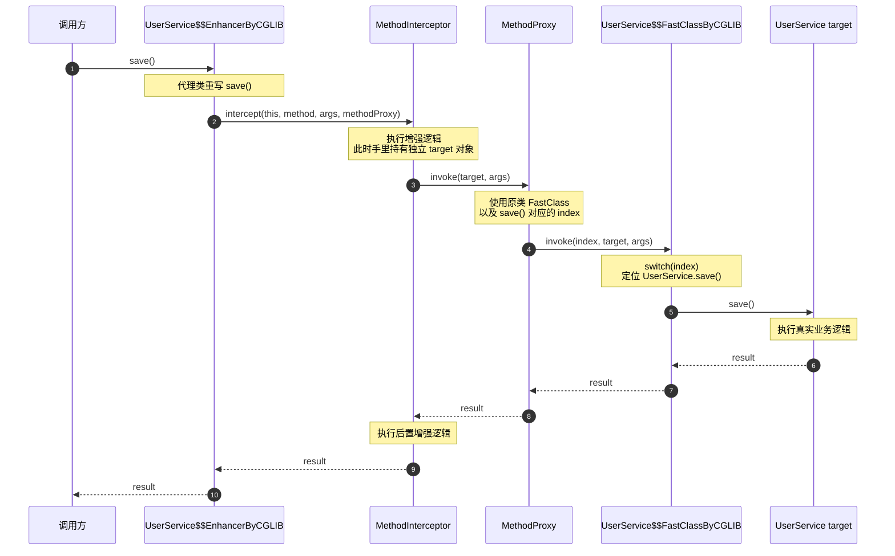

在被 Spring AOP 的八股碎语反复折磨后，我决定回归技术本质，通过拆解底层原理来终结这种碎片化的记忆。

本文将系统梳理 Java 代理的三种实现路径：**静态代理**、**JDK 动态代理** 与 **CGLIB**。

# 静态代理

静态代理即传统的代理模式实现，其核心特征是 **运行时开销极小**，但存在 **硬编码导致的类数量膨胀** 问题。

具体逻辑如下：

* **性能优势**：由于代理关系在编译期已确定，无需运行时动态生成字节码或使用反射，执行效率最高。
* **维护困境**：代理类与目标类强耦合。一旦接口增加新方法，代理类必须同步修改。在代理需求密集的场景下，这种 1:1 的关系会导致“类爆炸”，极难扩展与维护。
* **适用场景**：逻辑固定、代理对象单一且对运行时性能有极致要求的轻量化场景。

```java
// 1. 共同接口
public interface UserService {
    void saveUser();
}

// 2. 目标类（被代理类）
public class UserServiceImpl implements UserService {
    @Override
    public void saveUser() {
        System.out.println("执行数据库插入操作...");
    }
}

// 3. 静态代理类
public class UserServiceProxy implements UserService {
    // 内部维护目标对象的引用
    private final UserService target;

    public UserServiceProxy(UserService target) {
        this.target = target;
    }

    @Override
    public void saveUser() {
        System.out.println("开启数据库事务..."); // 前置增强
        target.saveUser();                       // 委托给目标类执行核心业务
        System.out.println("提交数据库事务..."); // 后置增强
    }
}

// 4. 客户端调用
public class Client {
    public static void main(String[] args) {
        UserService target = new UserServiceImpl();
        UserService proxy = new UserServiceProxy(target);
        proxy.saveUser(); // 通过代理对象调用
    }
}
```

# JDK 动态代理

JDK动态代理就是使用Java自带的反射，其性能损耗主要源于以下四个维度：

1. 查找开销（`getMethod`）：
`getMethod` 的底层实现是遍历目标类的 `Method[]` 数组。通过对方法名字符串及参数类型列表进行逐一比对（时间复杂度 O(n)）来定位目标方法。这是反射调用中 **最为耗时的环节**。

2. 装箱与数组创建（`invoke`）：
`invoke` 方法的签名为 `Object... args`。当传入基本类型（如 int）时，JVM 需在堆上执行装箱操作（创建 `Integer` 对象），并额外构造一个 `Object[]` 数组以容纳参数。频繁调用 `invoke` 会显著增加 GC 压力（装箱对象和 `Object[]` 会快速填满 Eden区）。

3. 权限校验：
每次调用均需执行 `Reflection.quickCheckMemberAccess()`，以验证调用方是否具备访问目标方法（权限控制、跨包访问等）的权限。虽可通过 `method.setAccessible(true)` 绕过安全检查，但仍存在逻辑判定开销。

4. 内联失效（JIT Optimization）：
原生调用：JIT 编译器能通过静态分析将方法机器码直接“内联”到调用方，消除函数调用栈开销。
反射调用：由于其动态分派特性，目标方法在编译期不可知，导致 JIT 无法执行内联优化，必须走完整的方法调用栈压栈与出栈流程。

```java
import java.lang.reflect.InvocationHandler;
import java.lang.reflect.Method;
import java.lang.reflect.Proxy;

// 1. 必须有接口
public interface UserService {
    void doSomething();
}

// 2. 目标类实现接口
public class UserServiceImpl implements UserService {
    @Override
    public void doSomething() {
        System.out.println("执行核心业务...");
    }
}

// 3. 实现 InvocationHandler 编写增强逻辑
public class MyInvocationHandler implements InvocationHandler {
    private final Object target; // 目标对象

    public MyInvocationHandler(Object target) {
        this.target = target;
    }

    @Override
    public Object invoke(Object proxy, Method method, Object[] args) throws Throwable {
        System.out.println("前置拦截...");
        Object result = method.invoke(target, args); // 反射调用目标方法
        System.out.println("后置拦截...");
        return result;
    }
}

// 4. 生成并使用代理对象
public class Main {
    public static void main(String[] args) {
        UserService target = new UserServiceImpl();
        UserService proxy = (UserService) Proxy.newProxyInstance(
            target.getClass().getClassLoader(),
            target.getClass().getInterfaces(),
            new MyInvocationHandler(target)
        );
        proxy.doSomething(); 
    }
}
```

有意思的是，Spring Boot 1.x 与 2.x 在默认代理策略上存在显著差异：

* **Spring Boot 1.x**：默认优先使用 **JDK 动态代理**。
    * **逻辑**：若被代理类实现了接口，则使用 JDK 代理；否则回退到 CGLIB。
    * **痛点**：JDK 动态代理生成的代理类与目标类是“兄弟”关系（均实现同一接口），而非“父子”关系。因此，代理对象无法向上转型为目标实现类，导致使用具体实现类接收注入时频繁报出 `BeanNotOfRequiredTypeException`。

* **Spring Boot 2.x**：默认切换为 **CGLIB 代理**。
    * **逻辑**：通过配置 `spring.aop.proxy-target-class=true`，强制默认使用 CGLIB。
    * **优势**：CGLIB 通过继承目标类生成子类，代理对象天然是目标类的实例，从而完美兼容了对具体实现类的注入。

```java
// 在 Spring Boot 1.x 默认配置下，若 UserService 存在接口，
// 此处会因代理类非 UserServiceImpl 子类而抛出异常。
@Autowired
private UserServiceImpl userService;
```

JDK 动态代理生成的代理类必须继承 `Proxy` 类，由于 Java 不支持多重继承，代理类只能通过实现目标接口来完成代理，而无法继承目标业务类。 

这一底层限制导致在 Spring Boot 1.x 版本中，默认生成的代理 Bean 仅具备接口类型。因此，依赖注入只能通过接口来接收；若开发者强行使用具体实现类来接收注入，就会因类型不匹配而报错。

# CGLIB代理

CGLIB 是后来为了弥补 JDK 动态代理的特定缺陷而诞生的开源解决方案。为了突破官方 **“必须有接口”** 的硬性限制，开源社区推出了 CGLIB。

CGLIB 凭借 **FastClass** 机制大幅提升了代码运行期的执行效率。但作为代价，代理单一目标类通常需要在底层动态生成 3 个全新的 Class 文件。这种重度依赖字节码生成的机制不仅会拖慢应用启动速度，还极易引发 JVM 元空间膨胀，是其核心缺陷。

## FastClass

FastClass 的思路则是，给每个方法编一个整数编号，例如：

```
0 -> sayHello(String)
1 -> save(User)
2 -> delete(Long)
3 -> toString()
```

然后生成一个包含类似这样方法的类：

```java
public Object invoke(int index, Object obj, Object[] args) {
    UserService service = (UserService) obj;

    switch (index) {
        case 0:
            return service.sayHello((String) args[0]);
    
        case 1:
            return service.save((User) args[0]);
    
        case 2:
            service.delete((Long) args[0]);
            return null;
    
        case 3:
            return service.toString();
    
        default:
            throw new IllegalArgumentException();
    }
}
```

于是方法调用就变成了：

```java
fastClass.invoke(0, service, new Object[]{"Tom"});
```

## 生成的class文件

CGLIB 创建 **一个** 代理类后，会生成 **三个** 新的类：

```
原始类 UserService
       │
       │ CGLIB Enhancer
       ▼
┌────────────────────────────────────────────┐
│ ① UserService$$EnhancerByCGLIB$$xxxx      │
│    → 真正的代理类                          │
└────────────────────────────────────────────┘
       │
       ├──────────────┐
       ▼              ▼
┌───────────────┐  ┌──────────────────────────────┐
│ ② UserService │  │ ③ UserService$$Enhancer...  │
│   $$FastClass │  │    $$FastClassByCGLIB$$xxxx │
│   ByCGLIB     │  │    → 代理类的 FastClass      │
└───────────────┘  └──────────────────────────────┘
```

1. `xxx$$EnhancerByCGLIB$$xxx`
   这是真正的代理类

2. `xxx$$FastClassByCGLIB$$xxx`

   这个是原始类的 FastClass

3. `xxx$$EnhancerByCGLIB$$xxx$$FastClassByCGLIB$$xxx`

   这是代理 `xxx$$EnhancerByCGLIB$$xxx` 类自己的 FastClass

> 为什么代理类自己还需要有 FastClass？
>
> CGLIB 生成的代理类可以简化理解成：
>
> ```java
> class UserService$$EnhancerByCGLIB extends UserService {
> 
>     @Override
>     public void save() {
>         interceptor.intercept(
>             this,				// 当前CGLIB代理对象
>             saveMethod,			// 被拦截方法对应的java.lang.reflect.Method
>             new Object[0],		// 方法调用传进来的实参
>             methodProxy			// CGLIB的MethodProxy，用于调用原方法
>         );
>     }
> }
> ```
>
> 代理类已经 **重写了 `save()`**，所以只要调用代理对象的 `save()`，就一定会进入 `intercept()`，会造成无限循环：
>
> ```
> proxy.save()
>     ↓
> UserService$$Enhancer.save()
>     ↓
> intercept()
>     ↓
> obj.save()
>     ↓
> obj 实际类型是 UserService$$Enhancer
>     ↓
> UserService$$Enhancer.save()
>     ↓
> intercept()
>     ↓
> obj.save()
>     ↓
> ...
> ```
>
> 所以CGLIB会专门生成 `` 方法：
>
> ```java
> class UserService$$EnhancerByCGLIB extends UserService {
> 
>     // 正常的代理入口
>     @Override
>     public void save() {
>         interceptor.intercept(
>             this,
>             saveMethod,
>             new Object[0],
>             methodProxy
>         );
>     }
> 
>     // CGLIB 额外生成
>     final void CGLIB$save$0() {
>         super.save();
>     }
> }
> ```
>
> 其中methodProxy会找到桥接方法：CGLIB$save$0，就可以避免无限循环，其中methodProxy会通过代理类的 FastClass 来找到 `CGLIB$save$0()` 方法并且调用。

## CGLIB代理流程

Springboot中多数情况如下所示：

```java
class UserService {
    void save() {
        print("真正业务逻辑");
    }
}

interceptor = new MethodInterceptor() {
    Object intercept(obj, method, args, methodProxy) {
        print("before");

        // obj 就是 CGLIB 代理对象
        result = methodProxy.invokeSuper(obj, args);

        print("after");
        return result;
    }
};

enhancer = new Enhancer();
enhancer.setSuperclass(UserService.class);
enhancer.setCallback(interceptor);

UserService proxy = enhancer.create();

proxy.save();
```

整体流程就不需要用到原类的 FastClass，只需要代理类和代理类的 FastClass 即可。



如果是如下情况：

```java
class UserService {
    void save() {
        print("真正业务逻辑");
    }
}


// 已经存在的真实对象
UserService target = new UserService();


interceptor = new MethodInterceptor() {

    Object intercept(obj, method, args, methodProxy) {
        print("before");

        // 不调用代理对象自己
        // 而是调用已有的真实 target
        result = methodProxy.invoke(target, args);

        print("after");
        return result;
    }
};


enhancer = new Enhancer();
enhancer.setSuperclass(UserService.class);
enhancer.setCallback(interceptor);

// 又创建了一个新的代理对象
UserService proxy = enhancer.create();

proxy.save();
```

则会使用到原类的 FastClass：




